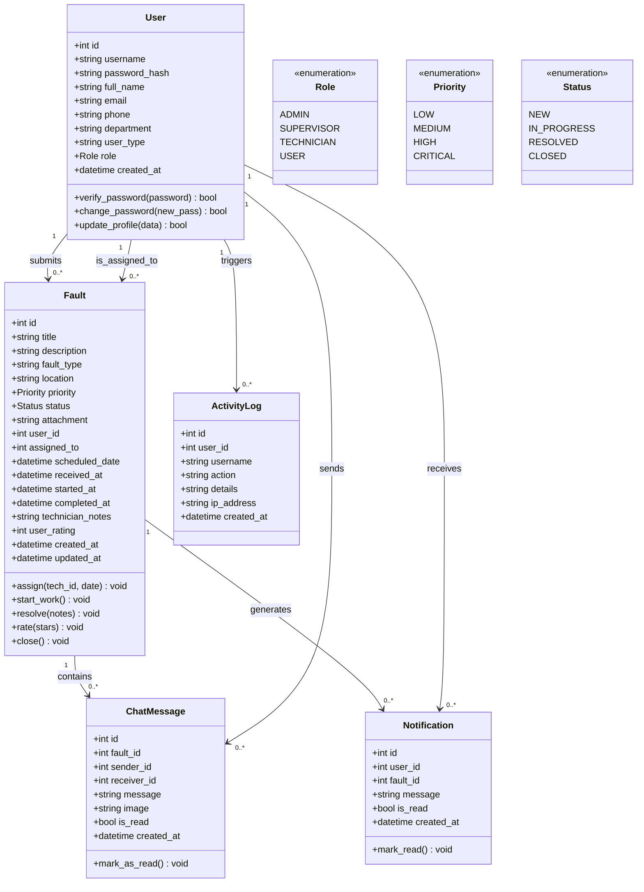
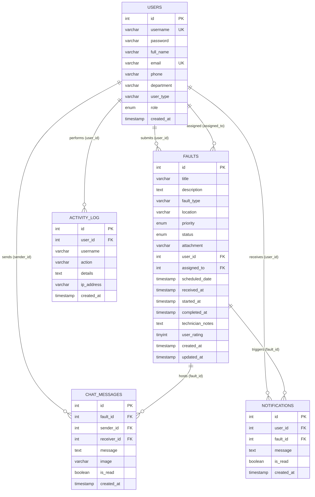
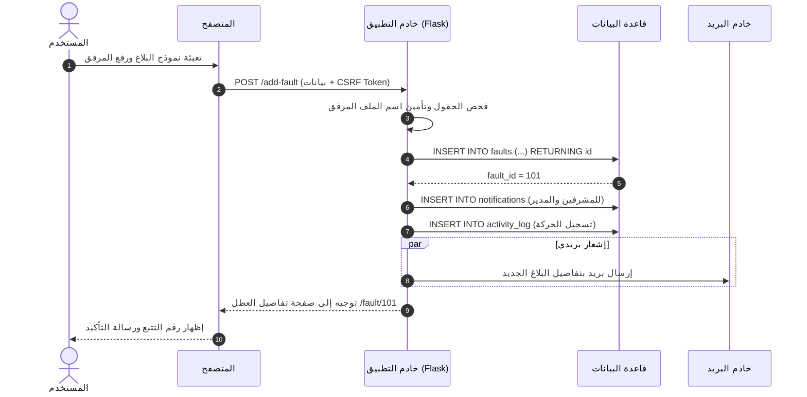
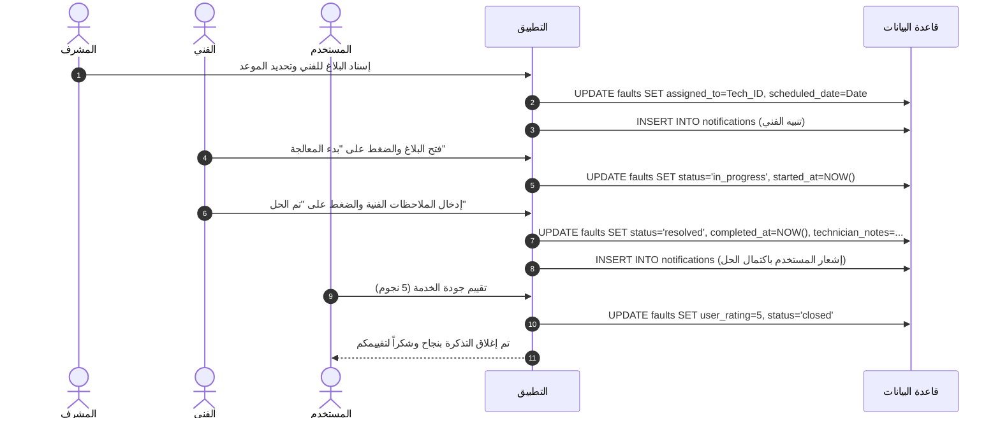
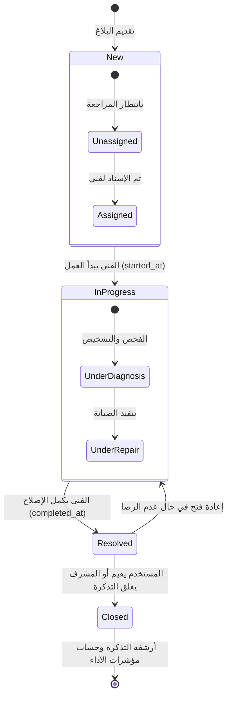
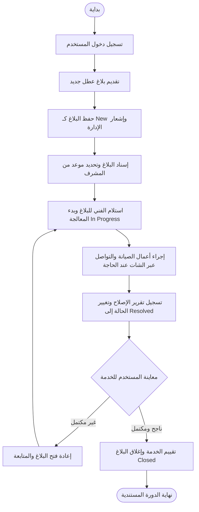
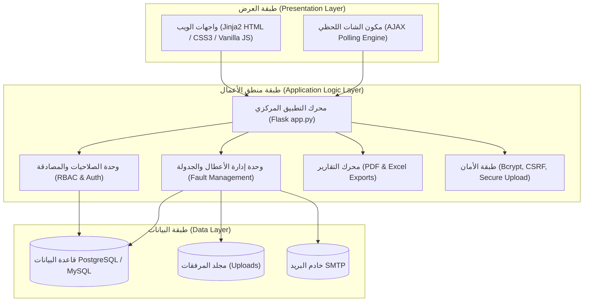
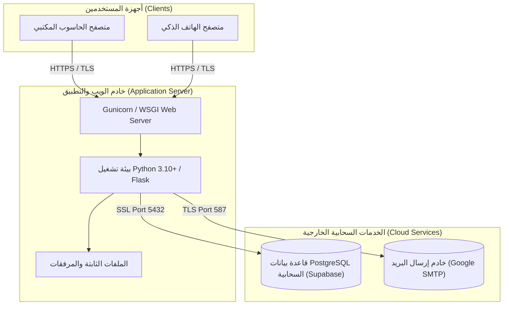

# وثيقة التحليل الشامل للنظام ونمذجة UML
## نظام إدارة وتتبع بلاغات الأعطال التقنية (IT Fault Management System)

---

## 📌 الفهرس العام
1. [المقدمة وأهداف النظام](#1-المقدمة-وأهداف-النظام)
2. [الجهات الفاعلة ومصفوفة الصلاحيات (Actors & RBAC)](#2-الجهات-الفاعلة-ومصفوفة-الصلاحيات)
3. [مخطط حالات الاستخدام (Use Case Diagram)](#3-مخطط-حالات-الاستخدام-use-case-diagram)
4. [مخطط الأصناف والكائنات (Class Diagram)](#4-مخطط-الأصناف-والكائنات-class-diagram)
5. [مخطط العلاقات الكينونية (ERD - Database Schema)](#5-مخطط-العلاقات-الكينونية-erd)
6. [مخططات التتابع للعمليات الأساسية (Sequence Diagrams)](#6-مخططات-التتابع-sequence-diagrams)
7. [مخطط انتقال الحالات للبلاغ (State Machine Diagram)](#7-مخطط-انتقال-الحالات-state-machine-diagram)
8. [مخطط النشاط وسير العمليات (Activity Diagram)](#8-مخطط-النشاط-وسير-العمليات-activity-diagram)
9. [مخطط المكونات المعمارية (Component Diagram)](#9-مخطط-المكونات-المعمارية-component-diagram)
10. [مخطط النشر والتوزيع (Deployment Diagram)](#10-مخطط-النشر-والتوزيع-deployment-diagram)

---

## 1. المقدمة وأهداف النظام

**نظام إدارة وتتبع الأعطال التقنية** هو نظام سحابي متكامل يهدف إلى أتمتة دورة حياة بلاغات الصيانة والدعم الفني داخل المؤسسات والإدارات، بدءاً من تسجيل البلاغ ومروراً بالجدولة والتوجيه، وصولاً إلى الإصلاح الفني والتقييم والإغلاق مع محادثة لحظية وإشعارات فورية.

### الأهداف الرئيسية:
- **أتمتة البلاغات:** سرعة تسجيل تذاكر الصيانة وإرفاق الصور التوضيحية.
- **إدارة الموارد:** توزيع المهام على الفنيين حسب التخصص والعبء الوظيفي.
- **التتبع الزمني اللحظي:** توثيق لحظات الاستلام، البدء، والانتهاء ومؤشرات الأداء (KPIs).
- **التواصل الفوري:** شات مدمج لكل بلاغ بين المستخدم والفني والإدارة.
- **التقارير التحليلية:** تصدير كشوفات الأعطال بصيغ PDF و Excel مع رسوم بيانية تفاعلية.

---

## 2. الجهات الفاعلة ومصفوفة الصلاحيات

### الممثلون (Actors):
1. **المستخدم العادي (User):** الموظف أو الطالب الذي يقوم بفتح البلاغات ومتابعتها وتقييمها.
2. **الفني التقني (Technician):** المسؤول عن تنفيذ الإصلاح وكتابة التقارير الفنية وقطع الغيار.
3. **المشرف (Supervisor):** المسؤول عن توزيع وإسناد البلاغات ومتابعة أداء الفنيين.
4. **مدير النظام (Admin):** المتحكم الكامل بالمستخدمين، الصلاحيات، الإعدادات، واستخراج التقارير.

### مصفوفة الصلاحيات (RBAC Matrix):
| الوظيفة | المستخدم (User) | الفني (Technician) | المشرف (Supervisor) | المدير (Admin) |
| :--- | :---: | :---: | :---: | :---: |
| تسجيل الدخول وإنشاء حساب | ✅ | ✅ | ✅ | ✅ |
| تقديم بلاغ جديد | ✅ | ✅ | ✅ | ✅ |
| استعراض بلاغاتي فقط | ✅ | ❌ | ❌ | ❌ |
| استعراض المهام المسندة | ❌ | ✅ | ✅ | ✅ |
| استعراض كل البلاغات | ❌ | ❌ | ✅ | ✅ |
| إسناد وجدولة البلاغ | ❌ | ❌ | ✅ | ✅ |
| بدء المعالجة وحل العطل | ❌ | ✅ | ✅ | ✅ |
| تقييم الخدمة (نجوم) | ✅ (صاحب البلاغ) | ❌ | ❌ | ❌ |
| استخدام شات البلاغ | ✅ (بلاغاته) | ✅ (المسند له) | ✅ | ✅ |
| إدارة المستخدمين والأدوار | ❌ | ❌ | ❌ | ✅ |
| تصدير التقارير (PDF/Excel) | ❌ | ❌ | ✅ | ✅ |

---

## 3. مخطط حالات الاستخدام (Use Case Diagram)

```mermaid
graph TD
    User((المستخدم))
    Tech((الفني))
    Super((المشرف))
    Admin((مدير النظام))

    subgraph "نظام إدارة وتتبع الأعطال التقنية"
        UC1[تسجيل الدخول / استعادة كلمة المرور]
        UC2[تقديم بلاغ عطل جديد مع المرفقات]
        UC3[متابعة مسار التذكرة والخط الزمني]
        UC4[المحادثة الفورية حول البلاغ]
        UC5[تقييم الخدمة 1-5 نجوم]
        
        UC6[استعراض المهام المسندة]
        UC7[بدء المعالجة وتسجيل الملاحظات]
        UC8[حل العطل وإرفاق تقرير الصيانة]
        
        UC9[إسناد العطل لفني وجدولته]
        UC10[متابعة مؤشرات أداء الفنيين]
        UC11[تصدير التقارير PDF / Excel]
        
        UC12[إدارة حسابات المستخدمين والصلاحيات]
        UC13[مراقبة سجل التدقيق والنشاطات]
    end

    User --> UC1
    User --> UC2
    User --> UC3
    User --> UC4
    User --> UC5

    Tech --> UC1
    Tech --> UC6
    Tech --> UC7
    Tech --> UC8
    Tech --> UC4

    Super --> UC1
    Super --> UC9
    Super --> UC10
    Super --> UC11
    Super --> UC3
    Super --> UC4

    Admin --> UC1
    Admin --> UC9
    Admin --> UC10
    Admin --> UC11
    Admin --> UC12
    Admin --> UC13
```

---

## 4. مخطط الأصناف والكائنات (Class Diagram)

---

## 5. مخطط العلاقات الكينونية (ERD)

---

## 6. مخططات التتابع (Sequence Diagrams)

### 6.1 دورة تقديم بلاغ جديد (Submit Fault)

### 6.2 دورة الإسناد والمعالجة والحل (Assignment & Resolution)

---

## 7. مخطط انتقال الحالات (State Machine Diagram)

---

## 8. مخطط النشاط وسير العمليات (Activity Diagram)

---

## 9. مخطط المكونات المعمارية (Component Diagram)

---

## 10. مخطط النشر والتوزيع (Deployment Diagram)

---
> 💡 **ملاحظة:** تتوفر أيضاً نسخة ويب تفاعلية متكاملة مع دعم المعاينة الحية والطباعة في المسار: [`docs/SYSTEM_ANALYSIS_AND_UML_DESIGN.html`](file:///c:/xampp/htdocs/it_fault_system/docs/SYSTEM_ANALYSIS_AND_UML_DESIGN.html) والوثيقة الشاملة المفصلة في [`docs/SYSTEM_ANALYSIS_AND_UML_DESIGN.md`](file:///c:/xampp/htdocs/it_fault_system/docs/SYSTEM_ANALYSIS_AND_UML_DESIGN.md).
