# وثيقة التحليل الفني والتصميم الهندسي الشامل ونمذجة UML
## نظام إدارة وتتبع الأعطال التقنية (Technical Fault Management System)

---

## 📑 فهرس المحتويات (Table of Contents)
1. [المقدمة ونظرة عامة على النظام (System Overview & Introduction)](#1-المقدمة-ونظرة-عامة-على-النظام)
2. [تحليل المتطلبات الوظيفية وغير الوظيفية (Requirements Analysis)](#2-تحليل-المتطلبات-الوظيفية-وغير-الوظيفية)
3. [الممثلون ومصفوفة الصلاحيات (Actors & RBAC Matrix)](#3-الممثلون-ومصفوفة-الصلاحيات)
4. [حزمة مخططات UML الكاملة (Complete UML Modeling Suite)](#4-حزمة-مخططات-uml-الكاملة)
   - 4.1 مخطط حالات الاستخدام العام والتفصيلي (Use Case Diagrams)
   - 4.2 مخطط الأصناف وهندسة الفئات (Class Diagram)
   - 4.3 مخطط العلاقات الكينونية وقاموس البيانات (ERD & Data Dictionary)
   - 4.4 مخططات التتابع للعمليات الأساسية (Sequence Diagrams)
   - 4.5 مخططات النشاط وتدفق الأعمال (Activity Diagrams)
   - 4.6 مخطط انتقال حالات العطل (State Machine Diagram)
   - 4.7 مخطط المكونات والطبقات المعمارية (Component Diagram)
   - 4.8 مخطط النشر والبنية التحتية السحابية (Deployment Diagram)
   - 4.9 مخطط الحزم وهيكلية الشيفرة (Package Diagram)
5. [التصميم التفصيلي لقاعدة البيانات (Database Architecture & Schema)](#5-التصميم-التفصيلي-لقاعدة-البيانات)
6. [تصميم واجهات المستخدم وتدفق الصفحات (UI/UX & Site Flow)](#6-تصميم-واجهات-المستخدم-وتدفق-الصفحات)
7. [هيكلية الأمان والتحصين السيبراني (Security Architecture)](#7-هيكلية-الأمان-والتحصين-السيبراني)
8. [التنفيذ البرمجي ومسارات النظام (Implementation & API Endpoints)](#8-التنفيذ-البرمجي-ومسارات-النظام)
9. [خطة الاختبار وضمان الجودة (Testing & Quality Assurance)](#9-خطة-الاختبار-وضمان-الجودة)
10. [دليل التثبيت والنشر والتشغيل (Deployment & Operations Guide)](#10-دليل-التثبيت-والنشر-والتشغيل)

---

## 1. المقدمة ونظرة عامة على النظام

### 1.1 نبذة عن المشروع
**نظام إدارة وتتبع الأعطال التقنية** هو منصة متكاملة على الويب صُممت لأتمتة دورة حياة بلاغات الصيانة والدعم الفني داخل المؤسسات الأكاديمية والخدمية (مثل الجامعات والكليات والإدارات). يهدف النظام إلى استبدال الطرق التقليدية الورقية وغير المنظمة بمنظومة رقمية تفاعلية تدعم المتابعة اللحظية، توزيع المهام، المحادثة المباشرة، التنبيهات الفورية عبر البريد والنظام، والتحليلات الإحصائية الدقيقة.

### 1.2 أهداف النظام (System Objectives)
- **رقمنة بلاغات الصيانة:** تمكين منسوبي المؤسسة من تسجيل البلاغات ورفع الصور التوضيحية في ثوانٍ.
- **الحوكمة والتوجيه الذكي:** توزيع البلاغات آلياً أو يدوياً للفنيين المختصين ومتابعة مؤشرات الأداء (KPIs).
- **الشفافية وسرعة الاستجابة:** توفير تتبع زمني مفصل لكل مرحلة من مراحل الإصلاح (استلام، بدء، إنجاز، إغلاق).
- **التواصل اللحظي:** توفير قناة دردشة خاصة لكل تذكرة صيانة لتبادل المعلومات بين المستخدم والفني والإدارة.
- **دعم اتخاذ القرار:** تقارير متقدمة مع إمكانية التصدير بصيغ (PDF / Excel) ورسوم بيانية تفاعلية.

### 1.3 المكدس التكنولوجي (Technology Stack)
- **لغة البرمجة وإطار العمل:** Python 3.10+ مع Flask Framework
- **قاعدة البيانات:** PostgreSQL (على منصة Supabase Cloud) مع توافقية MySQL / SQLite
- **المكتبات الإضافية:**
  - `Flask-Bcrypt`: لتشفير كلمات المرور (Blowfish Adaptive Hashing)
  - `Flask-WTF & WTForms`: للحماية من ثغرات CSRF والتحقق من صحة المدخلات
  - `Flask-Mail`: لإرسال الإشعارات البريدية التلقائية عبر SMTP
  - `ReportLab`: لإنشاء وثائق وتقارير PDF الاحترافية
  - `OpenPyXL`: لتوليد جداول البيانات الإحصائية وإكسل
  - `Psycopg2-binary`: وسيط الاتصال عالي الأداء مع PostgreSQL
- **الواجهة الأمامية (Frontend):** HTML5, CSS3 الحديث مع دعم Glassmorphism وتصميم متجاوب كامل (Responsive Web Design)، خطوط Google Fonts الاحترافية (Cairo / Inter)، وVanilla JavaScript للعمليات التفاعلية وAJAX.

---

## 2. تحليل المتطلبات الوظيفية وغير الوظيفية

### 2.1 المتطلبات الوظيفية (Functional Requirements - FR)
- **FR-01: إدارة الحسابات والمصادقة (Authentication & Authorization):**
  - تسجيل حساب مستخدم جديد وتحديد جهة العمل/الكلية/القسم.
  - تسجيل الدخول الآمن مع تذكر الجلسة والحماية من الهجمات.
  - استعادة كلمة المرور عبر إرسال كود تحقق مؤقت (OTP) إلى البريد الإلكتروني.
  - إدارة الملف الشخصي وتحديث بيانات الاتصال وكلمة المرور.
- **FR-02: إدارة بلاغات الأعطال (Fault Management):**
  - إنشاء تذكرة عطل مع تحديد (العنوان، الوصف، نوع العطل، الموقع، درجة الأهمية، المرفقات).
  - استعراض البلاغات مع محرك بحث وتصفية متقدم (حسب الحالة، الأولوية، القسم، التاريخ).
  - تعديل تفاصيل البلاغ من قِبل صاحبه قبل البدء في معالجته، أو حذفه من قِبل المسؤولين.
- **FR-03: التعيين والجدولة (Assignment & Scheduling):**
  - إسناد البلاغ لفني محدد من قِبل المشرف أو مدير النظام مع تحديد تاريخ المعالجة المتوقع.
- **FR-04: تنفيذ المعالجة والدعم الفني (Technical Resolution):**
  - استلام الفني للبلاغ وتحديث حالته إلى (قيد المعالجة).
  - إضافة الملاحظات الفنية والإجراءات المتخذة.
  - توثيق وقت البداية والانتهاء الفعلي وتغيير الحالة إلى (تم الحل).
- **FR-05: التقييم وإغلاق البلاغ (Rating & Closing):**
  - تقييم المستخدم لجودة الخدمة المقدمة (1-5 نجوم) مع تقديم ملاحظات الجودة.
  - إغلاق البلاغ نهائياً وتأكيد اكتمال الدورة المستندية.
- **FR-06: نظام المحادثة اللحظية (Ticket Chat System):**
  - محادثة مخصصة لكل بلاغ عطل بين صاحب التذكرة والفني المعالج والإدارة.
  - إمكانية رفع الصور الداعمة للمحادثة وتتبع حالة قراءة الرسائل.
- **FR-07: الإشعارات والتنبيهات (Notifications):**
  - إشعارات داخلية فورية تظهر في شريط التنقل وتنبيه المستخدمين بكل تحديث.
  - إرسال رسائل بريد إلكتروني تفاعلية عند إنشاء البلاغ، إسناده، حله، أو إغلاقه.
- **FR-08: التحليلات والتقارير (Analytics & Reporting):**
  - لوحات تحكم ديناميكية (Dashboards) مخصصة حسب دور المستخدم.
  - إحصائيات بصرية حول توزيع الأعطال حسب الأقسام ونسب الإنجاز وزمن الاستجابة.
  - تصدير كشوفات الأعطال والتقارير المالية/الفنية إلى ملفات Excel و PDF منسقة ومطبوعة.
- **FR-09: سجل التدقيق والنشاط (Audit Trail & Activity Log):**
  - تسجيل كافة حركات النظام الهامة مع معرف المستخدم وعنوان الـ IP والطابع الزمني.

### 2.2 المتطلبات غير الوظيفية (Non-Functional Requirements - NFR)
- **NFR-01: الأمان (Security):** تشفير كلمات المرور باستخدام `Bcrypt`، تطبيق حماية صارمة ضد هجمات `CSRF`، تعقيم الاستعلامات ضد `SQL Injection` عبر المعاملات البارامترية، وتأمين ملفات تعريف الارتباط `HttpOnly & SameSite=Lax`.
- **NFR-02: الأداء والسرعة (Performance):** زمن استجابة لا يتجاوز ثانية واحدة للاستعلامات العادية واستخدام الفهارس (Indexes) على المفاتيح الأجنبية وحقول التصفية المتكررة.
- **NFR-03: التوافر والاعتمادية (Availability & Reliability):** استضافة قاعدة البيانات سحابياً على Supabase مع اتصال آمن SSL، وضمان استمرار العمل ودعم تكرار الاتصال عند انقطاع الشبكة.
- **NFR-04: التوافقية وقابلية التدويل (Localization & Usability):** دعم ثنائي للغتين العربية والإنجليزية مع تعديل تلقائي لاتجاه الواجهات (RTL / LTR) وسهولة الاستخدام عبر مختلف الأجهزة (Desktops, Tablets, Mobiles).
- **NFR-05: القابلية للتوسع والتكامل (Scalability & Maintainability):** بنية معمارية موديولية (Modular Design) تتيح إضافة نماذج ذكاء اصطناعي للتنبؤ بالأعطال أو ربطها مع بوابات الدفع لاحقاً بسهولة.

---

## 3. الممثلون ومصفوفة الصلاحيات (Actors & RBAC Matrix)

### 3.1 الجهات الفاعلة في النظام (System Actors)
1. **المستخدم العادي (Regular User / Staff):** الموظف أو عضو هيئة التدريس أو الطالب الذي يقوم بفتح البلاغات ومتابعتها وتقييمها.
2. **الفني التقني (Technician):** المهندس أو الفني المختص بمعالجة الأعطال وكتابة التقارير الفنية.
3. **المشرف (Supervisor):** المسؤول عن متابعة القسم وإسناد الأعطال للفنيين وتدقيق التقارير.
4. **مدير النظام (Admin):** المتحكم الشامل بالنظام، إدارة المستخدمين، الصلاحيات، الإعدادات، واستخراج كافة التقارير.

### 3.2 مصفوفة الصلاحيات (Role-Based Access Control Matrix)

| الوظيفة / الإجراء | المستخدم العادي (User) | الفني (Technician) | المشرف (Supervisor) | مدير النظام (Admin) |
| :--- | :---: | :---: | :---: | :---: |
| تسجيل حساب جديد وتسجيل الدخول | ✅ | ✅ | ✅ | ✅ |
| تقديم بلاغ عطل جديد | ✅ | ✅ | ✅ | ✅ |
| استعراض البلاغات الخاصة فقط | ✅ | ❌ | ❌ | ❌ |
| استعراض البلاغات المسندة إليه | ❌ | ✅ | ✅ | ✅ |
| استعراض جميع بلاغات النظام | ❌ | ❌ | ✅ | ✅ |
| تعديل البلاغ قبل المعالجة | ✅ (بلاغاته فقط) | ❌ | ✅ | ✅ |
| إسناد العطل وتحديد الموعد | ❌ | ❌ | ✅ | ✅ |
| تحديث حالة العطل وإضافة تقرير الحل | ❌ | ✅ (المسندة له) | ✅ | ✅ |
| تقييم جودة الخدمة (Rating) | ✅ (صاحب البلاغ) | ❌ | ❌ | ❌ |
| إغلاق البلاغ نهائياً | ❌ | ❌ | ✅ | ✅ |
| استخدام شات البلاغ | ✅ (بلاغاته) | ✅ (المسندة له) | ✅ | ✅ |
| إدارة المستخدمين والصلاحيات | ❌ | ❌ | ❌ | ✅ |
| تصدير التقارير (Excel / PDF) | ❌ | ❌ | ✅ | ✅ |
| الاطلاع على سجل النشاطات (Audit Logs) | ❌ | ❌ | ❌ | ✅ |

---

## 4. حزمة مخططات UML الكاملة (Complete UML Modeling Suite)

### 4.1 مخطط حالات الاستخدام العام (General Use Case Diagram)

```mermaid
graph TD
    User((المستخدم العادي))
    Tech((الفني التقني))
    Super((المشرف))
    Admin((مدير النظام))

    subgraph "نظام إدارة وتتبع الأعطال التقنية"
        UC1[تسجيل الدخول / استعادة الحساب]
        UC2[تقديم بلاغ عطل مع مرفقات]
        UC3[متابعة مسار التذكرة والخط الزمني]
        UC4[المحادثة اللحظية حول البلاغ]
        UC5[تقييم الخدمة بعد الحل]
        
        UC6[استعراض المهام المسندة]
        UC7[بدء المعالجة وتسجيل الملاحظات]
        UC8[حل العطل وإرفاق تقرير الإنجاز]
        
        UC9[إسناد العطل وجدولته]
        UC10[متابعة مؤشرات أداء الفنيين]
        UC11[تصدير التقارير PDF / Excel]
        
        UC12[إدارة حسابات المستخدمين والأدوار]
        UC13[مراقبة سجل التدقيق والأمان]
        UC14[إعدادات النظام العامة]
    end

    User --> UC1
    User --> UC2
    User --> UC3
    User --> UC4
    User --> UC5

    Tech --> UC1
    Tech --> UC6
    Tech --> UC7
    Tech --> UC8
    Tech --> UC4

    Super --> UC1
    Super --> UC9
    Super --> UC10
    Super --> UC11
    Super --> UC3
    Super --> UC4

    Admin --> UC1
    Admin --> UC9
    Admin --> UC10
    Admin --> UC11
    Admin --> UC12
    Admin --> UC13
    Admin --> UC14
```

---

### 4.2 مخطط الأصناف وهندسة الفئات (Class Diagram)

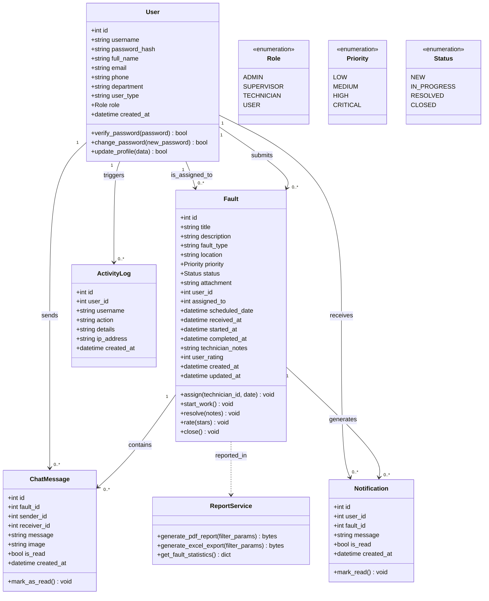

---

### 4.3 مخطط العلاقات الكينونية لقاعدة البيانات (Entity Relationship Diagram - ERD)

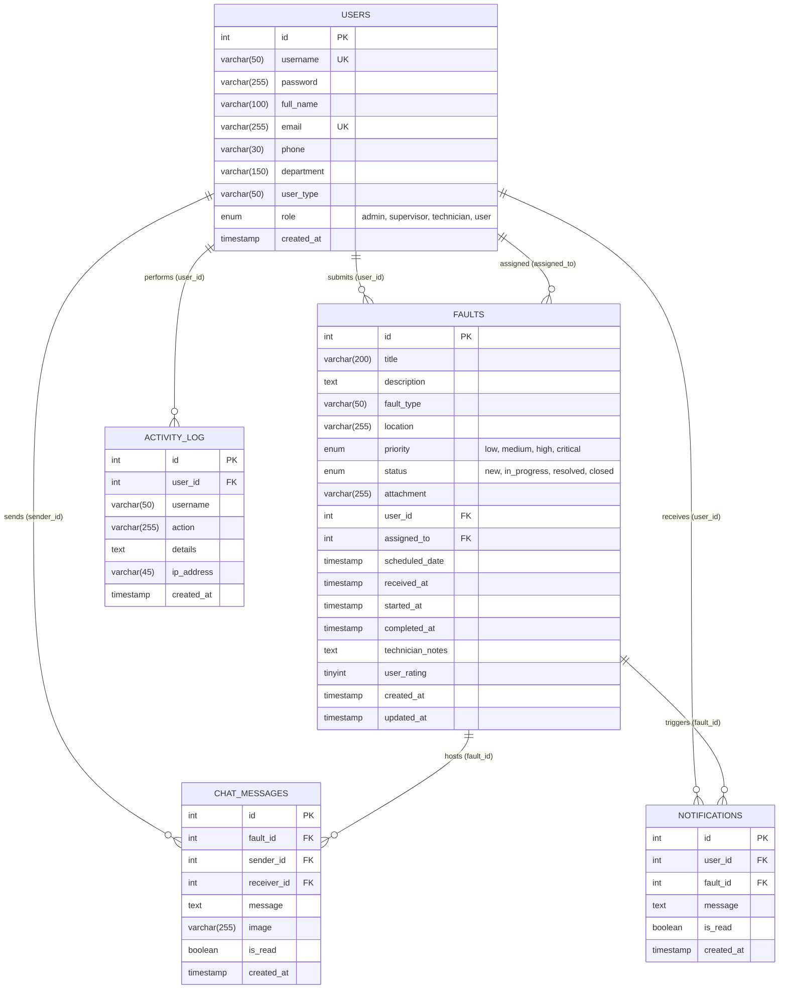

---

### 4.4 مخططات التتابع (Sequence Diagrams)

#### 4.4.1 مخطط تتابع تقديم بلاغ جديد وإرسال الإشعارات (Add Fault Flow)

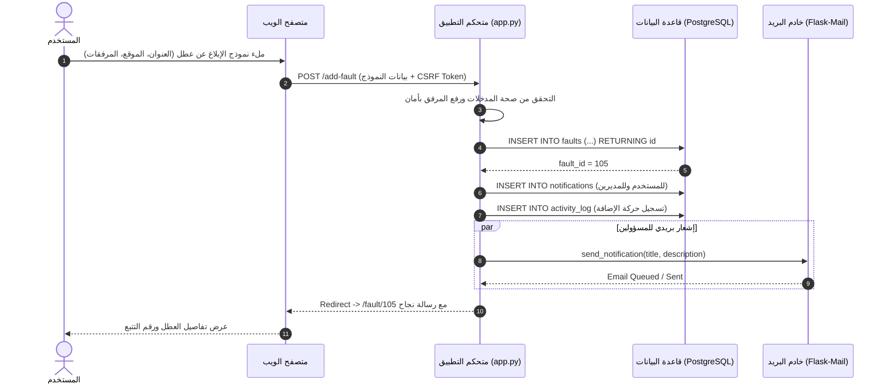

#### 4.4.2 مخطط تتابع إسناد العطل ومعالجته وحله (Fault Assignment & Resolution Flow)

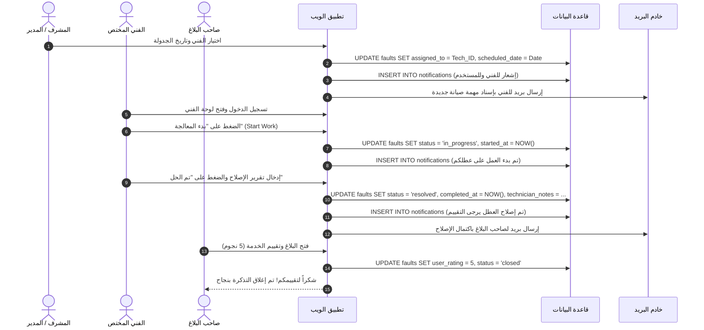

#### 4.4.3 مخطط تتابع المحادثة اللحظية (Fault Ticket Real-time Chat)

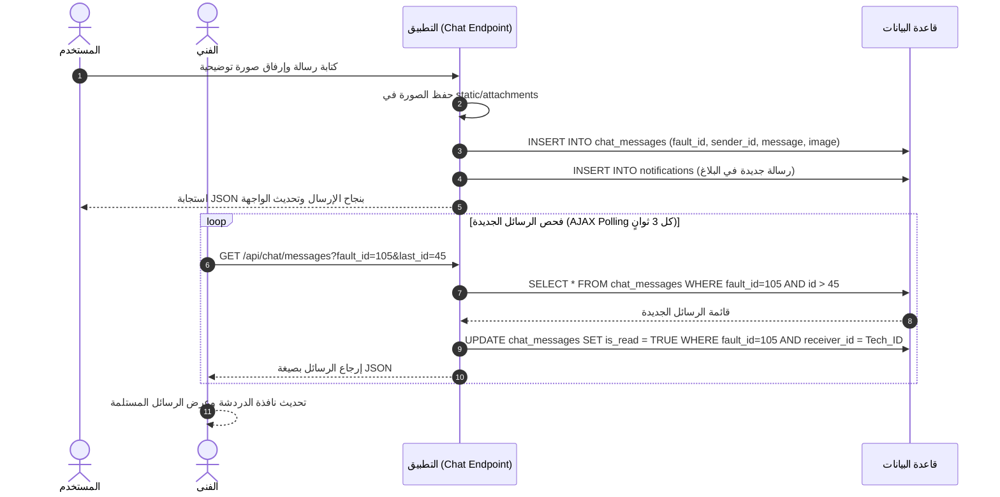

---

### 4.5 مخططات النشاط وتدفق العمليات (Activity Diagrams)

#### 4.5.1 دورة حياة بلاغ الصيانة الشاملة (Fault Life-cycle Workflow)

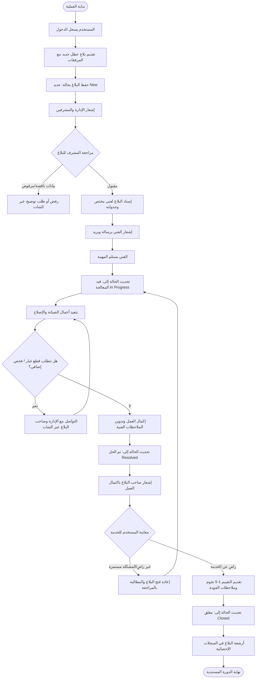

---

### 4.6 مخطط انتقال الحالات للبلاغ (State Machine Diagram)

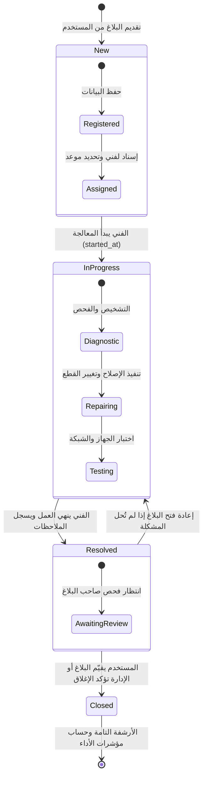

---

### 4.7 مخطط المكونات والبنية المعمارية (Component Diagram - 3-Tier Architecture)

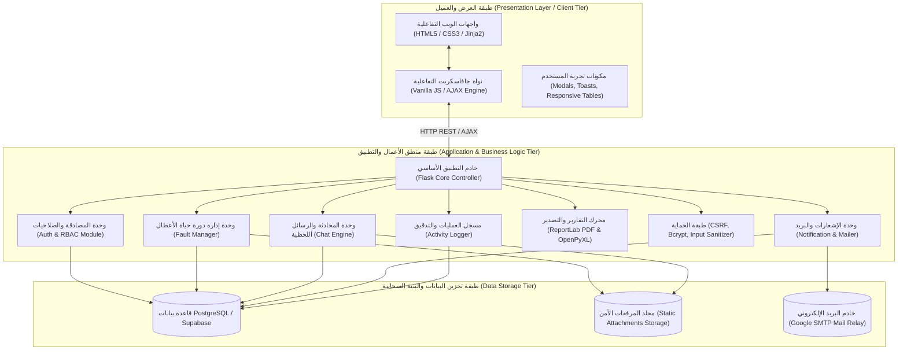

---

### 4.8 مخطط النشر والتوزيع (Deployment Diagram)

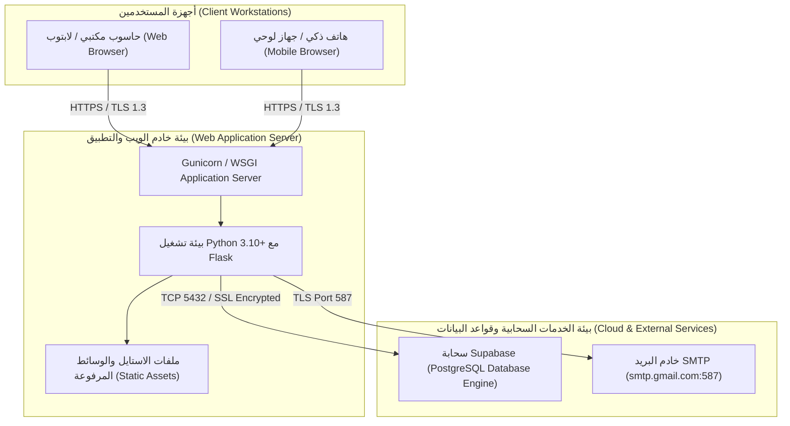

---

### 4.9 مخطط الحزم وهيكلية الشيفرة (Package Diagram)

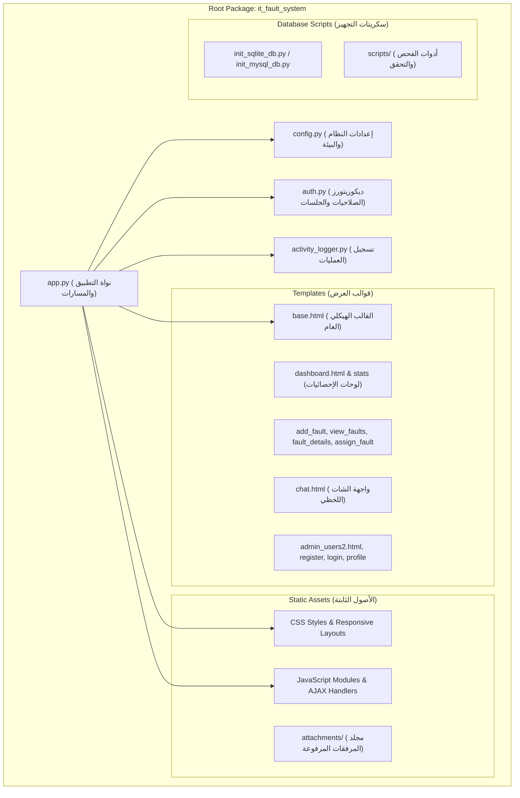

---

## 5. التصميم التفصيلي لقاعدة البيانات (Data Dictionary)

### 5.1 جدول المستخدمين (`users`)
| اسم الحقل | نوع البيانات | القيود | الوصف |
| :--- | :--- | :--- | :--- |
| `id` | SERIAL / INT | PK, Auto Increment | المعرف الفريد للمستخدم |
| `username` | VARCHAR(50) | NOT NULL, UNIQUE | اسم الدخول للنظام |
| `password` | VARCHAR(255) | NOT NULL | كلمة المرور المشفرة بتقنية Bcrypt |
| `full_name` | VARCHAR(100) | NULLABLE | الاسم الكامل الثلاثي للمستخدم |
| `email` | VARCHAR(255) | UNIQUE, NULLABLE | البريد الإلكتروني الرسمي |
| `phone` | VARCHAR(30) | NULLABLE | رقم هاتف الاتصال / الواتساب |
| `department` | VARCHAR(150) | NULLABLE | الكلية أو الإدارة أو القسم التابع له |
| `user_type` | VARCHAR(50) | NULLABLE | الصفة (موظف، عضو هيئة تدريس، طالب) |
| `role` | VARCHAR(20) | DEFAULT 'user' | الدور: (`admin`, `supervisor`, `technician`, `user`) |
| `created_at` | TIMESTAMP | DEFAULT NOW() | تاريخ ووقت إنشاء الحساب |

### 5.2 جدول بلاغات الأعطال (`faults`)
| اسم الحقل | نوع البيانات | القيود | الوصف |
| :--- | :--- | :--- | :--- |
| `id` | SERIAL / INT | PK, Auto Increment | الرقم المرجعي للبلاغ (التذكرة) |
| `title` | VARCHAR(200) | NOT NULL | عنوان مختصر للعطل |
| `description` | TEXT | NULLABLE | تفاصيل وشرح المشكلة التقنية |
| `fault_type` | VARCHAR(50) | NULLABLE | التصنيف (أجهزة، برمجيات، شبكات، طابعات، إنترنت) |
| `location` | VARCHAR(255) | NULLABLE | مكان العطل بالتفصيل (المبنى، الطابق، الغرفة) |
| `priority` | VARCHAR(20) | DEFAULT 'medium' | الأهمية (`low`, `medium`, `high`, `critical`) |
| `status` | VARCHAR(20) | DEFAULT 'new' | حالة البلاغ (`new`, `in_progress`, `resolved`, `closed`) |
| `attachment` | VARCHAR(255) | NULLABLE | مسار الصورة أو الملف المرفق |
| `user_id` | INT | FK -> users(id) | صاحب البلاغ |
| `assigned_to` | INT | FK -> users(id), NULL | الفني المسند إليه البلاغ |
| `scheduled_date` | TIMESTAMP | NULLABLE | الموعد المقترح للزيارة أو الصيانة |
| `received_at` | TIMESTAMP | NULLABLE | توقيت استلام البلاغ من قِبل المشرف |
| `started_at` | TIMESTAMP | NULLABLE | توقيت بدء الفني للعمل الفعلي |
| `completed_at` | TIMESTAMP | NULLABLE | توقيت اكتمال الإصلاح |
| `technician_notes`| TEXT | NULLABLE | تقرير الفني والملاحظات وقطع الغيار |
| `user_rating` | SMALLINT | CHECK (1 to 5) | تقييم رضا العميل عن الخدمة |
| `created_at` | TIMESTAMP | DEFAULT NOW() | تاريخ فتح البلاغ |
| `updated_at` | TIMESTAMP | DEFAULT NOW() | تاريخ آخر تعديل على الحالة |

### 5.3 جدول رسائل المحادثة (`chat_messages`)
| اسم الحقل | نوع البيانات | القيود | الوصف |
| :--- | :--- | :--- | :--- |
| `id` | SERIAL / INT | PK, Auto Increment | معرف الرسالة |
| `fault_id` | INT | FK -> faults(id) | البلاغ التابع له المحادثة |
| `sender_id` | INT | FK -> users(id) | مرسل الرسالة |
| `receiver_id` | INT | FK -> users(id), NULL | مستقبل الرسالة المباشر |
| `message` | TEXT | NOT NULL | نص الرسالة |
| `image` | VARCHAR(255) | NULLABLE | مسار الصورة المرفقة بالرسالة |
| `is_read` | BOOLEAN | DEFAULT FALSE | حالة قراءة الرسالة |
| `created_at` | TIMESTAMP | DEFAULT NOW() | وقت الإرسال |

### 5.4 جدول الإشعارات (`notifications`)
| اسم الحقل | نوع البيانات | القيود | الوصف |
| :--- | :--- | :--- | :--- |
| `id` | SERIAL / INT | PK, Auto Increment | معرف الإشعار |
| `user_id` | INT | FK -> users(id) | المستخدم المستلم للإشعار |
| `fault_id` | INT | FK -> faults(id), NULL | التذكرة المرتبطة |
| `message` | TEXT | NOT NULL | نص التنبيه المختصر |
| `is_read` | BOOLEAN | DEFAULT FALSE | حالة القراءة |
| `created_at` | TIMESTAMP | DEFAULT NOW() | توقيت صدور الإشعار |

### 5.5 جدول سجل الأنشطة والتدقيق (`activity_log`)
| اسم الحقل | نوع البيانات | القيود | الوصف |
| :--- | :--- | :--- | :--- |
| `id` | SERIAL / INT | PK, Auto Increment | معرف سجل النشاط |
| `user_id` | INT | FK -> users(id), NULL | معرف المستخدم المنفذ للعملية |
| `username` | VARCHAR(50) | NULLABLE | اسم المستخدم وقت الحركة |
| `action` | VARCHAR(255) | NOT NULL | عنوان الإجراء المتخذ |
| `details` | TEXT | NULLABLE | تفاصيل إضافية عن التغيير |
| `ip_address` | VARCHAR(45) | NULLABLE | عنوان الآي بي للجهاز المنفذ |
| `created_at` | TIMESTAMP | DEFAULT NOW() | الطابع الزمني للعملية |

---

## 6. تصميم واجهات المستخدم وتدفق الصفحات (UI/UX Design)

### 6.1 خريطة تدفق الصفحات والتنقل (Site Map)

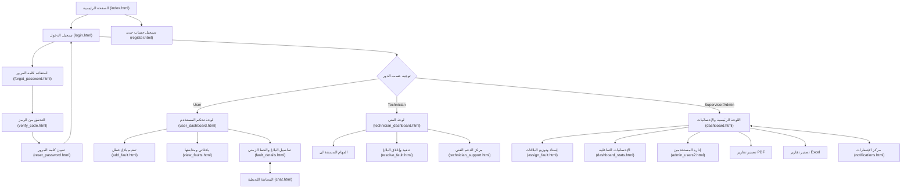

### 6.2 المبادئ الجمالية للتصميم (Design System)
- **نظام الألوان الحديث (Color Palette):**
  - اللون الأساسي (Primary): الأزرق الاحترافي النيلي `#1e3a8a` / `#2563eb`
  - اللون الثانوي والتأكيد (Accent): البنفسجي العصري `#6366f1` والأزرق الفيروزي `#06b6d4`
  - درجات الحالة (Status Colors):
    - جديد (New): الأزرق الهادئ `#3b82f6`
    - قيد المعالجة (In Progress): البرتقالي التحذيري `#f59e0b`
    - تم الحل (Resolved): الأخضر الزمردي `#10b981`
    - حرج (Critical Priority): الأحمر القرمزي `#ef4444`
- **التصميم الزجاجي الأنيق (Glassmorphism & Micro-animations):**
  - استخدام بطاقات شفافة خفيفة بحدود ناعمة وظلال غامرة (`box-shadow: 0 10px 25px rgba(0,0,0,0.08)`).
  - تأثيرات تفاعلية ناعمة عند التمرير والضغط (`Transitions & Keyframe Animations`).
  - تصميم متجاوب 100% مع الهواتف الذكية عبر `Flexbox` و `CSS Grid`.

---

## 7. هيكلية الأمان والتحصين السيبراني (Security Architecture)

1. **حماية التوثيق وكلمات المرور:**
   - تطبيق خوارزمية التشفير التكيفية `Bcrypt` المقاومة لهجمات القوة الغاشمة (Brute-force) وقواميس الكلمات مع ملح تشفير عشوائي تلقائي (Salt).
2. **الوقاية من هجمات تزوير الطلب عبر المواقع (CSRF Protection):**
   - تفعيل `Flask-WTF CSRFProtect` على جميع نماذج الإرسال بـ `POST/PUT/DELETE` وتضمين رموز أمان ديناميكية فريدة لكل جلسة.
3. **الوقاية من هجمات حقن قواعد البيانات (SQL Injection Defense):**
   - الاعتماد التام على الاستعلامات البارامترية المعقمة في مكتبة `psycopg2` وتجنب دمج السلاسل النصية المباشرة نهائياً.
4. **الوقاية من هجمات حقن النصوص البرمجية (XSS Defense):**
   - التهريب التلقائي للمدخلات عبر محرك القوالب `Jinja2 Auto-escaping`.
5. **تأمين رفع الملفات (Secure File Upload):**
   - تطبيق دالة `secure_filename` لإزالة المحارف الخطيرة.
   - التحقق الصارم من الامتدادات المصرح بها (`png`, `jpg`, `pdf`, `doc`, `xlsx`).
   - تحديد الحد الأقصى لحجم الملفات بـ 16 ميجابايت لمنع هجمات حجب الخدمة (DoS).
6. **أمان الجلسات وملفات تعريف الارتباط (Session Security):**
   - تعيين `HttpOnly=True` و `SameSite=Lax` و `Cache-Control: no-store` لمنع سرقة الجلسات وتخزين البيانات الحساسة في ذاكرة المتصفح المؤقتة بعد تسجيل الخروج.

---

## 8. التنفيذ البرمجي ومسارات النظام (API & Route Specification)

### 8.1 جدول المسارات الأساسية في التطبيق (`app.py`)

| المسار (Endpoint) | الطريقة (Method) | الصلاحية المطلوبة | الوصف والوظيفة |
| :--- | :---: | :---: | :--- |
| `/` | GET | للجميع | الصفحة الترحيبية وتوجيه المستخدمين |
| `/login` | GET / POST | للجميع | مصادقة المستخدم وبدء الجلسة |
| `/register` | GET / POST | للجميع | إنشاء حساب مستخدم جديد |
| `/logout` | GET | تسجيل دخول | إنهاء الجلسة وحذف الكوكيز |
| `/forgot-password` | GET / POST | للجميع | طلب رمز استعادة كلمة المرور عبر البريد |
| `/verify-code` | GET / POST | للجميع | مطابقة كود الـ OTP |
| `/reset-password` | GET / POST | للجميع | تحديث كلمة المرور الجديدة |
| `/dashboard` | GET | مسجل دخول | لوحة التحكم الذكية الموجهة للدور |
| `/add-fault` | GET / POST | مسجل دخول | تقديم بلاغ عطل مع رفع مرفق |
| `/view-faults` | GET | مسجل دخول | استعراض البلاغات مع الفلاتر |
| `/fault/<id>` | GET | مسجل دخول | تفاصيل البلاغ والخط الزمني |
| `/edit-fault/<id>` | GET / POST | مسجل دخول | تعديل البلاغ لصاحبه أو المشرف |
| `/assign-fault/<id>`| GET / POST | Supervisor / Admin | إسناد البلاغ وتحديد الموعد للفني |
| `/resolve-fault/<id>`| GET / POST | Technician / Admin | تسجيل تقرير الإصلاح وتغيير الحالة |
| `/rate-fault/<id>` | POST | صاحب البلاغ | تقييم الرضا عن معالجة العطل |
| `/close-fault/<id>`| POST | Supervisor / Admin | إغلاق التذكرة نهائياً |
| `/delete-fault/<id>`| POST | Admin | حذف البلاغ من السجلات |
| `/chat/<fault_id>` | GET / POST | أطراف البلاغ | واجهة المحادثة اللحظية |
| `/api/chat/messages`| GET | أطراف البلاغ | جلب رسائل الشات الجديدة بصيغة JSON |
| `/notifications` | GET | مسجل دخول | عرض جميع الإشعارات للمستخدم |
| `/notifications/read-all`| POST | مسجل دخول | تحديد كافة الإشعارات كمقروءة |
| `/export/excel` | GET | Supervisor / Admin | تصدير بيانات الأعطال إلى Excel |
| `/export/pdf` | GET | Supervisor / Admin | تصدير تقرير احترافي بصيغة PDF |
| `/admin/users` | GET / POST | Admin | إدارة المستخدمين وتعديل الأدوار |
| `/set-language/<lang>`| GET | للجميع | التبديل بين اللغتين (عربي / إنجليزي) |

---

## 9. خطة الاختبار وضمان الجودة (Testing & QA Plan)

### 9.1 مصفوفة حالات الاختبار (Test Cases Suite)

| رقم الاختبار | الوحدة المختبرة | السيناريو والمدخلات | النتيجة المتوقعة | الحالة |
| :---: | :--- | :--- | :--- | :---: |
| **TC-01** | تسجيل الدخول | إدخال اسم مستخدم وكلمة مرور صحيحة | الدخول بنجاح والتوجيه للوحة التحكم المطابقة لدوره | ✅ ناجح |
| **TC-02** | تسجيل الدخول | إدخال كلمة مرور خاطئة 3 مرات | رفض الدخول وظهور تنبيه خطأ واضح | ✅ ناجح |
| **TC-03** | تقديم عطل | إدخال عنوان + وصف + تحديد كلية + صورة JPG | إنشاء البلاغ بحالة (جديد) وإرسال إشعار للمدير | ✅ ناجح |
| **TC-04** | رفع المرفقات | محاولة رفع ملف تنفيذي خبيث `test.exe` | رفض الملف لعدم تطابق الامتداد المسموح | ✅ ناجح |
| **TC-05** | إسناد العطل | المشرف يسند بلاغاً للفني (أحمد) بموعد محدد | تحديث الفني، إرسال إشعار بريدي، وظهوره في لوحة الفني | ✅ ناجح |
| **TC-06** | حل العطل | الفني يضغط بدء العمل ثم يكتب التقرير ويحل العطل | تحديث الحالة لـ Resolved وتوثيق وقت الإنجاز | ✅ ناجح |
| **TC-07** | التقييم والإغلاق| صاحب البلاغ يمنح 5 نجوم مع ملاحظة إيجابية | حفظ التقييم وتحويل حالة البلاغ إلى Closed | ✅ ناجح |
| **TC-08** | الشات المباشر | إرسال رسالة نصية مع صورة في تذكرة الصيانة | حفظ الرسالة وظهورها للفني فورياً عبر AJAX Polling | ✅ ناجح |
| **TC-09** | تصدير PDF/Excel| استخراج تقرير مصفى لأعطال كلية الهندسة | تحميل ملف منسق يحتوي كافة البيانات الصحيحة | ✅ ناجح |
| **TC-10** | حماية الصلاحيات| محاولة مستخدم عادي الدخول لمسار `/admin/users` | اعتراض الطلب وعرض خطأ 403 Forbidden | ✅ ناجح |

---

## 10. دليل التثبيت والنشر والتشغيل (Deployment Guide)

### 10.1 متطلبات التشغيل (System Requirements)
- خادم يدعم Python 3.10 أو أحدث (مثل PythonAnywhere, Render, AWS, أو سيرفر محلي XAMPP).
- قاعدة بيانات PostgreSQL (سحابية عبر Supabase أو محلية).
- مفتاح بريد إلكتروني صالح (Google App Password) لخدمة الإشعارات البريدية.

### 10.2 خطوات التثبيت والتشغيل المحلي (Local Setup)
```bash
# 1. استنساخ المشروع أو الانتقال للمجلد
cd c:\xampp\htdocs\it_fault_system

# 2. إنشاء بيئة بايثون افتراضية وتفعيلها
python -m venv venv
.\venv\Scripts\activate

# 3. تثبيت الاعتماديات والمكتبات اللازمة
pip install -r requirements.txt

# 4. إعداد ملف المتغيرات البيئية (.env)
# قم بضبط الرابط الخاص بقاعدة بيانات PostgreSQL ومفتاح التشفير

# 5. تشغيل السيرفر المحلي
python app.py
```

### 10.3 بيانات الدخول الافتراضية للتجربة (Default Demo Credentials)
- **مدير النظام (Admin):** اسم المستخدم `admin` | كلمة المرور `123456`
- **مشرف التقنية (Supervisor):** اسم المستخدم `supervisor1` | كلمة المرور `123456`
- **فني صيانة 1 (Technician 1):** اسم المستخدم `tech1` | كلمة المرور `123456`
- **فني صيانة 2 (Technician 2):** اسم المستخدم `tech2` | كلمة المرور `123456`

---

> **تم إعداد وثيقة التحليل والتصميم الهندسي ونمذجة UML هذه بأعلى معايير هندسة البرمجيات الاحترافية لتوثيق وتشغيل نظام إدارة وتتبع الأعطال التقنية بدقة وشمولية.**
